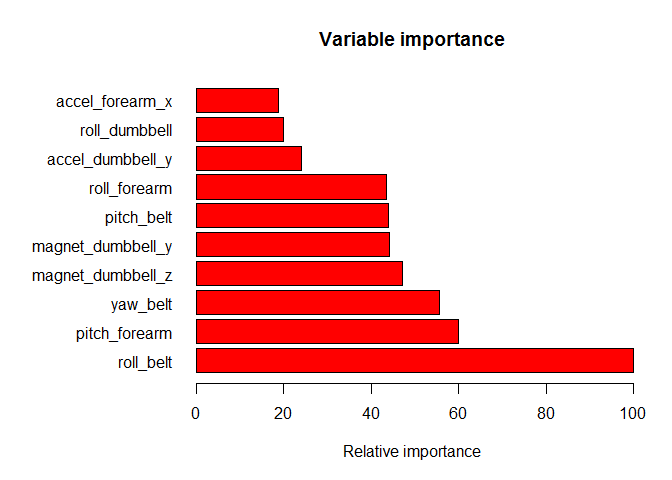

# Practical Machine Learning<br>Prediction Assignment Writeup
Ola Lie  
January 30, 2016  
Introduction
------------
People regularly quantify how much of a particular activity they do, but they rarely quantify how well they do it. In the HAR project (http://groupware.les.inf.puc-rio.br/har) they use data from accelerometers on the belt, forearm, arm, and dumbell of 6 participants to develop digital assistants for weight lifting exercises. The participants were asked to perform barbell lifts correctly and incorrectly in 5 different ways: exactly according to the specification (Class A), throwing the elbows to the front (Class B), lifting the dumbbell only halfway (Class C), lowering the dumbbell only halfway (Class D) and throwing the hips to the front (Class E). Our goal is to build a model that can predict the class with data from the accelerometers.

Summary
-------
I first tried linear discriminant analysis which is a classic method for classification of multiple classes (>2) proposed by Fisher in 1936. The trained lda model gave a 69.3% accuracy on the testing set. Then I tried a Random Forests approach which is one of several tree-based methods. Initially, the training of the model took a long time, but I speeded it up with parallel processing and switching from default bootstrap to k-fold cross-validation. The trained rf model gave a 99.3 % accuracy on the testing set so I did not try any more models. Finally, I listed the ten most important predictors and predicted the 20 unknown classes for the Course Project Prediction Quiz.

```r
require(caret)      ## Classification And REgression Training
require(MASS)       ## includes linear discriminant analysis
require(doParallel) ## parallel processing
```

Preparing the datasets
----------------------
The original data contain 19622 observations and 160 columns. Many columns are empty or filled with NAs. When these are removed, we are left with 53 columns: 52 predictors and one response (classe). I spilt the observations 75% in a training set and 25% in a testing set.

```r
## "https://d396qusza40orc.cloudfront.net/predmachlearn/pml-training.csv")
## "https://d396qusza40orc.cloudfront.net/predmachlearn/pml-testing.csv")
## setwd("C:/Users/olalie/Documents/DataScience/8_PracticalMachineLearning/COURSE_PROJECTS")
df <- read.csv('pml-training.csv',na.strings=c("","NA"))
df2 <- read.csv('pml-testing.csv',na.strings=c("","NA"))

## remove the first seven columns and columns with more than 90% NAs
df<-df[,-(1:7)]
df<-df[,colSums(is.na(df))<0.9*nrow(df)]
dim(df)
```

```
## [1] 19622    53
```

```r
names(df)
```

```
##  [1] "roll_belt"            "pitch_belt"           "yaw_belt"            
##  [4] "total_accel_belt"     "gyros_belt_x"         "gyros_belt_y"        
##  [7] "gyros_belt_z"         "accel_belt_x"         "accel_belt_y"        
## [10] "accel_belt_z"         "magnet_belt_x"        "magnet_belt_y"       
## [13] "magnet_belt_z"        "roll_arm"             "pitch_arm"           
## [16] "yaw_arm"              "total_accel_arm"      "gyros_arm_x"         
## [19] "gyros_arm_y"          "gyros_arm_z"          "accel_arm_x"         
## [22] "accel_arm_y"          "accel_arm_z"          "magnet_arm_x"        
## [25] "magnet_arm_y"         "magnet_arm_z"         "roll_dumbbell"       
## [28] "pitch_dumbbell"       "yaw_dumbbell"         "total_accel_dumbbell"
## [31] "gyros_dumbbell_x"     "gyros_dumbbell_y"     "gyros_dumbbell_z"    
## [34] "accel_dumbbell_x"     "accel_dumbbell_y"     "accel_dumbbell_z"    
## [37] "magnet_dumbbell_x"    "magnet_dumbbell_y"    "magnet_dumbbell_z"   
## [40] "roll_forearm"         "pitch_forearm"        "yaw_forearm"         
## [43] "total_accel_forearm"  "gyros_forearm_x"      "gyros_forearm_y"     
## [46] "gyros_forearm_z"      "accel_forearm_x"      "accel_forearm_y"     
## [49] "accel_forearm_z"      "magnet_forearm_x"     "magnet_forearm_y"    
## [52] "magnet_forearm_z"     "classe"
```

```r
set.seed(23)
inTrain = createDataPartition(df$classe, p = 3/4)[[1]]
training = df[ inTrain,]
testing = df[-inTrain,]
```

Linear Discriminant Analysis
----------------------------
This lda model gives a 69.3% accuracy.

```r
set.seed(07)
lda.fit <- lda(classe~.,data=training)
lda.pred <- predict(lda.fit,testing)
lda.cm <- confusionMatrix(lda.pred$class,testing$classe)
lda.cm$overall['Accuracy']
```

```
##  Accuracy 
## 0.6931077
```

```r
lda.cm$table
```

```
##           Reference
## Prediction    A    B    C    D    E
##          A 1108  143   78   37   37
##          B   33  604   77   34  152
##          C  130  118  564  109   87
##          D  118   43  112  585   87
##          E    6   41   24   39  538
```

Building a Random Forests Classification Model
----------------------------------------------
Random forests is known to be one of the best among classification algorithms. I have chosen to use five-fold cross validation. Using five-fold or ten-fold cross-validation have been shown empirically to yield test error rate estimates that suffer neither from excessively high bias nor from very high variance (ref. page 184 http://www-bcf.usc.edu/~gareth/ISL/) This rf model gives a 99.3% accuracy.

```r
## configure parallel processing
cluster <- makeCluster(detectCores()-1)
registerDoParallel(cluster)

## configure trainControl object
fitControl <- trainControl(method="cv", number=5, allowParallel = TRUE)

## develop training model
set.seed(57)
t1<-Sys.time()  ## timestamp to measure runtime, see Appendix Runtime
rf.fit  <- train(classe~., data=training, method="rf",trControl=fitControl)
t2<-Sys.time()  ## timestamp to measure runtime, see Appendix Runtime

## de-register parallel processing cluster
stopCluster(cluster)
```

```r
rf.pred <- predict(rf.fit, testing)
rf.cm <-confusionMatrix(testing$classe, rf.pred)   
rf.cm$overall['Accuracy']
```

```
##  Accuracy 
## 0.9932708
```

```r
rf.cm$table
```

```
##           Reference
## Prediction    A    B    C    D    E
##          A 1394    1    0    0    0
##          B    7  940    2    0    0
##          C    0    5  849    1    0
##          D    0    0   15  788    1
##          E    0    0    1    0  900
```

Interpretation
--------------
Here are the ten most important variables using the mean decrease i Gini index, expressed relative to the maximum.

```r
## Variable importance using the mean decrease in Gini index.
rf.imp <- importance(rf.fit$finalModel)
rf.imp <- rf.imp[order(rf.imp,decreasing = TRUE),,drop=FALSE]
rf.imp <- rf.imp[1:10,,drop=FALSE]
rf.imp <- data.frame(100*rf.imp/rf.imp[1])

par(mar=c(5,10,4,2))            ## get enough space for the variable names
barplot(rf.imp$MeanDecreaseGini,
    horiz=TRUE,
    names.arg=rownames(rf.imp),
    col='red',
    las=1,
    main="Variable importance", 
  	xlab="Relative importance")
```

\

```r
par(mar=c(5.1, 4.1, 4.1, 2.1))  ## reset margins
```

Predictions
-----------
Below you find the predictions for the unknown classes in the Course Project Prediction Quiz (Score 20/20)

```r
predict(rf.fit,df2)
```

```
##  [1] B A B A A E D B A A B C B A E E A B B B
## Levels: A B C D E
```

Appendix
--------

```r
t<-round(as.numeric(difftime(t2,t1,units='min')),1)
```

Runtime
-------
It took 10 minutes to train this random forests model.  

Session Info
------------

```r
sessionInfo()
```

```
## R version 3.1.3 (2015-03-09)
## Platform: x86_64-w64-mingw32/x64 (64-bit)
## Running under: Windows 8 x64 (build 9200)
## 
## locale:
## [1] LC_COLLATE=Norwegian (Bokmål)_Norway.1252 
## [2] LC_CTYPE=Norwegian (Bokmål)_Norway.1252   
## [3] LC_MONETARY=Norwegian (Bokmål)_Norway.1252
## [4] LC_NUMERIC=C                              
## [5] LC_TIME=Norwegian (Bokmål)_Norway.1252    
## 
## attached base packages:
## [1] parallel  stats     graphics  grDevices utils     datasets  methods  
## [8] base     
## 
## other attached packages:
## [1] randomForest_4.6-12 doParallel_1.0.10   iterators_1.0.8    
## [4] foreach_1.4.3       MASS_7.3-39         caret_6.0-64       
## [7] ggplot2_2.0.0       lattice_0.20-30    
## 
## loaded via a namespace (and not attached):
##  [1] car_2.0-25         class_7.3-12       codetools_0.2-10  
##  [4] colorspace_1.2-6   compiler_3.1.3     digest_0.6.9      
##  [7] e1071_1.6-7        evaluate_0.8       formatR_1.2.1     
## [10] grid_3.1.3         gtable_0.1.2       htmltools_0.3     
## [13] knitr_1.12         lme4_1.1-10        magrittr_1.5      
## [16] Matrix_1.1-5       MatrixModels_0.4-1 mgcv_1.8-4        
## [19] minqa_1.2.4        munsell_0.4.2      nlme_3.1-120      
## [22] nloptr_1.0.4       nnet_7.3-9         pbkrtest_0.4-4    
## [25] plyr_1.8.3         quantreg_5.19      Rcpp_0.12.3       
## [28] reshape2_1.4.1     rmarkdown_0.9.2    scales_0.3.0      
## [31] SparseM_1.7        splines_3.1.3      stats4_3.1.3      
## [34] stringi_1.0-1      stringr_1.0.0      tools_3.1.3       
## [37] yaml_2.1.13
```
